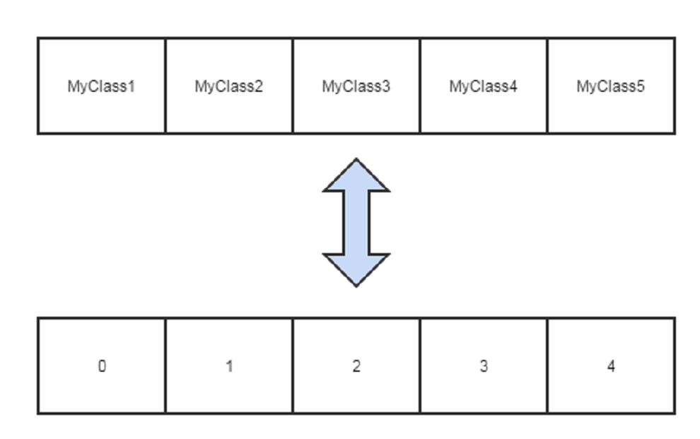
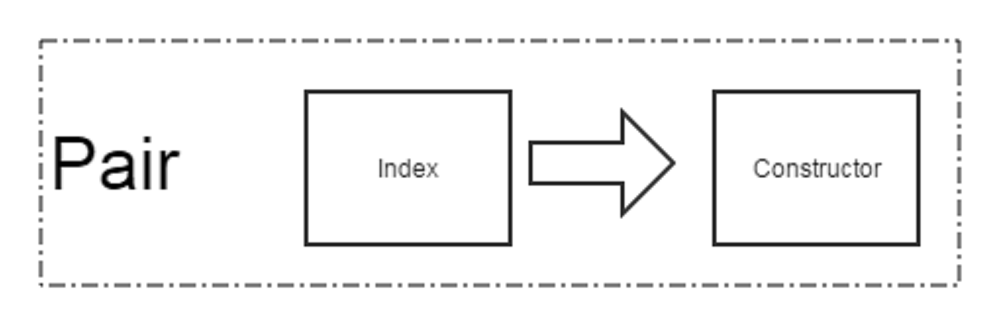
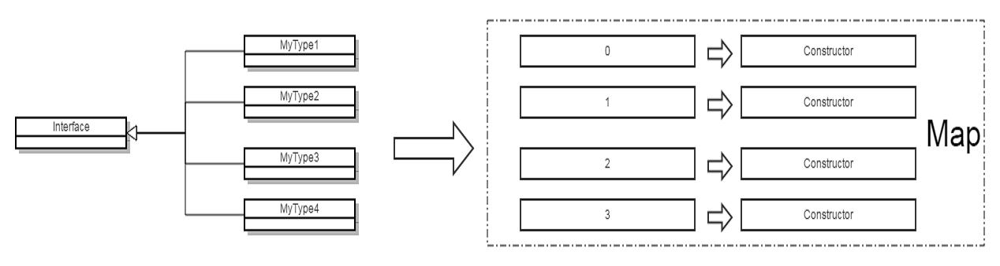
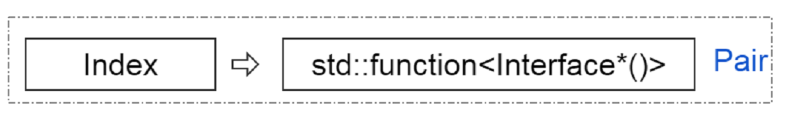
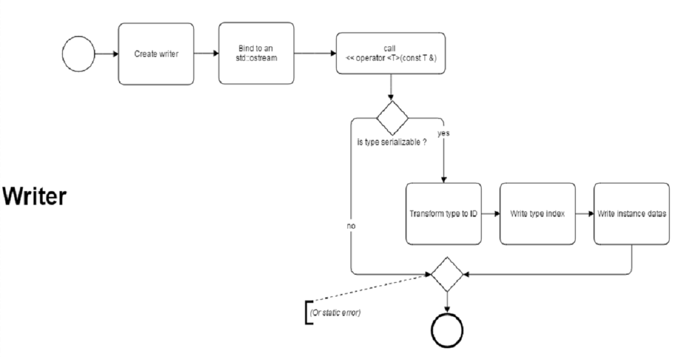
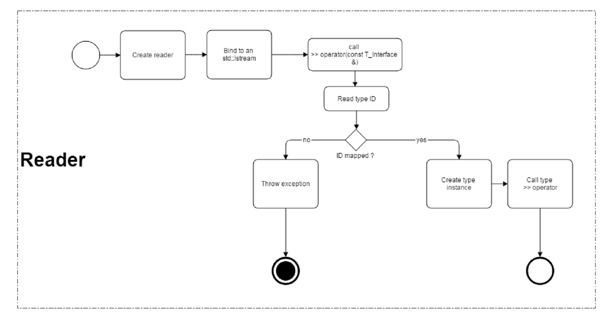

# C++ &nbsp; Serialization

&nbsp;

&nbsp;

---

## Guillaume &nbsp; [*Guss*](https://github.com/GuillaumeDua) &nbsp; Dua

---

&nbsp;

&nbsp;

[CC BY-SA 4.0](http://creativecommons.org/licenses/by-sa/4.0/deed.fr)

[cppfrug.org / paris / events / 2017-01-19_n14 / Serial](http://cpp-frug.github.io/paris/events/2017-01-19_n14/Serial/)

[github.com / cpp-frug / paris / events / 2017-01-19_n14 / Serial](https://github.com/cpp-frug/paris/blob/master/events/2017-01-19_n14/Serial/README.md)


`GCL::Serialization`
-------------------

* [github.com/GuillaumeDua/GCL_CPP](https://github.com/GuillaumeDua/GCL_CPP)  

* Two-way mapping  
  **Type** <---> **Index**  

* Accessors  
  **Static**  
  **Dynamic**  

* Runtime  
  **Write** into a file  
  **Read** the file


Static mapping (theory)
-----------------------



Static mapping (implementation)
-------------------------------
```cpp
template <typename ... Types>
struct TypePack
{
  using types_t = std::tuple<Types...>;

  // Template function - Mapping Type -> ID
  template <typename T>
  static constexpr inline size_t indexOf(void);                

  // Template type - Mapping ID -> Type
  template <size_t N>
  using TypeAt = typename std::tuple_element<N, types_t>::type;
};
```
```cpp
using MyType = TypePack<...>.TypeAt<42>;              // Static value
const size_t index = TypePack<...>.indexOf<MyType>(); // Correct
```
```cpp
size_t myTypeIndex = foo();                           // Dynamic value
using MyType = TypePack<...>.TypeAt<myTypeIndex>;     // ERROR
```


Dynamic mapping (theory)
------------------------
1. `std::map<Key,Value>` (template parameters)
2. Initializer-list for template viariadics expansion
3. Polymorphism


Dynamic mapping (theory)
------------------------



Dynamic mapping (theory)
------------------------



Dynamic mapping (theory)
------------------------



Dynamic mapping (implementation)
--------------------------------
```cpp
template <class Interface>
struct InterfaceIs
{
  template <typename ...Types>
  struct OfTypes
  {
    template <typename Policy = Binary>
    struct Writer;
    
    template <typename Policy = Binary>
    struct Reader;
  }
}	
```


`Writer` (dynamic mapping)
--------------------------



`Writer` (dynamic mapping)
--------------------------
```cpp
template <typename Policy = Binary>
struct Writer
{
  template <typename T>
  Writer & operator<< (const T & element)
  {
    Policy::write(_oStream, TypePack<...>::template indexOf<T>());
    os << element;
    return *this;
  }
};
```


`Reader` (dynamic mapping)
--------------------------



`Reader` (dynamic mapping)
--------------------------
```cpp
template <typename Policy = Binary>
struct Reader
{
  // Two-way mapping Type <--> ID
  using mapping_t = typename InterfaceIs<Interface>::template OfTypes<Types...>;

  static Interface * read (std::istream & is)
  {
    size_t typeIndex;
    Policy::read(is, typeIndex);

    if (is.eof()) return 0x0;

    auto & constructor = mapping_t::index.at(typeIndex).defaultConstructeurCallerOp;
    Interface * elem = constructor();
    is >> *elem;
    return elem;
  }
	
  Reader &  operator>> (Interface *& element);
  Reader &  operator>> (std::queue<Interface*> & elemQueue);
};
```


Dynamic mapping usage
---------------------
```cpp
struct TestInterface
{
  virtual void DoStuff() const = 0;
};

GenTestClass(Toto, int);
GenTestClass(Titi, std::string);
GenTestClass(Tata, int);
GenTestClass(Tutu, std::string);
```
```cpp
#define GenTestClass(name, type)                                  \
struct name : TestInterface                                       \
{                                                                 \
  type _value;                                                    \
                                                                  \
  name() = default;                                               \
  name(type value) : _value(value) {}                             \
                                                                  \
  void  DoStuff() const override                                  \
  { std::cout << #name " -> value=["<< _value <<']'<< std::endl; }\
                                                                  \
  std::ostream & operator<< (std::ostream & os) const override    \
  { Binary::write(os, _value); return os; }                       \
                                                                  \
  std::istream & operator>> (std::istream & is) override          \
  { Binary::read(is, _value); return is; }                        \
}
```


`Writer` usage (dynamic mapping)
--------------------------------
```cpp
using Writer = InterfaceIs<TestInterface>::OfTypes<Toto, Titi, Tata, Tutu>::Writer<>;

std::stringstream ss;
Writer(ss)
  << Toto{ 42 }
  << Titi{ "Hello, world" }
  << Tata{ 130390 }
  << Tutu{ "Morning' coffee" }
;
std::cout << "Serialized : [" << ss.str() << ']' << std::endl;
```

Output

    Serialized : [    *   ☺   ♀   Hello, world☻   V²☺ ♥   ☼   Morning' coffee]


`Reader` usage (dynamic mapping)
--------------------------------
```cpp
using Reader = InterfaceIs<TestInterface>::OfTypes<Toto, Titi, Tata, Tutu>::Reader<>;

std::stringstream ss;
Reader reader(ss);

std::queue<TestInterface*> elements;
reader
  >> elements
;

while (not elements.empty())
{
  elements.front()->DoStuff();  // TestInterface::DoStuff
  delete elements.front();
  elements.pop();
}
```

Output

    Toto -> value=[42]
    Titi -> value=[Hello, world]
    Tata -> value=[130390]
    Tutu -> value=[Morning' coffee]


Bonus
=====

&nbsp;

Forbid serialization for some types
-----------------------------------
C# has attribute `[NonSerialized()]`  
### How in C++?


What we want
------------
```cpp
struct Huge
{
  enum NonSerialized{};

  BigStuff _bigStuff;
};

Writer(ss)
  << Toto{42}
  << Huge{13}  // ERROR
;
```


#### Detect member `NonSerialized` using macro `GenHasNested`
```cpp
GenHasNested(NonSerialized);

template <typename T>
struct Writer
{                                       // From macro GenHasNested
  static constexpr bool nonSerialized = has_NonSerialized_nested<T>::value;

  template <bool NonSerialized = nonSerialized>
  static constexpr void   write        (std::ostream & os, const T & var);
  
  template <>
  static constexpr void   write<true>  (std::ostream & os, const T & var)
  {
    static_assert(false, "This type has NonSerialized static-qualifier");
  }

  template <>
  static constexpr void   write<false> (std::ostream & os, const T & var)
  {
    Policy::write (os, TypesPack<...>::template indexOf<T>());
    os << var;
  }
};
```


The macro `GenHasNested`
-----------------------

&nbsp;

Inspired from [Walter Brown](https://www.youtube.com/watch?v=a0FliKwcwXE) (CppCon 2014)

```std::void_t<typename T:: >```

&nbsp;

```cpp
#define GenHasNested(nested)                                                           \
                                                                                       \
template< class, class = std::void_t<> >                                               \
struct has_##nested##_nested : std::false_type { };                                    \
                                                                                       \
template< class T >                                                                    \
struct has_##nested##_nested<T, std::void_t<typename T::##nested>> : std::true_type { }
```


Future
======
* Codec
* Encryption
* Backward version compatibility


Annex
=====


**C#** `[NonSerialized()]` attribute
------------------------------------

```Csharp
namespace Sample
{
    public class DataToSerialize
    {
        // ...
        [NonSerialized()]
        // ...
	private BigStuff _bigStuff;
    }
}
```
