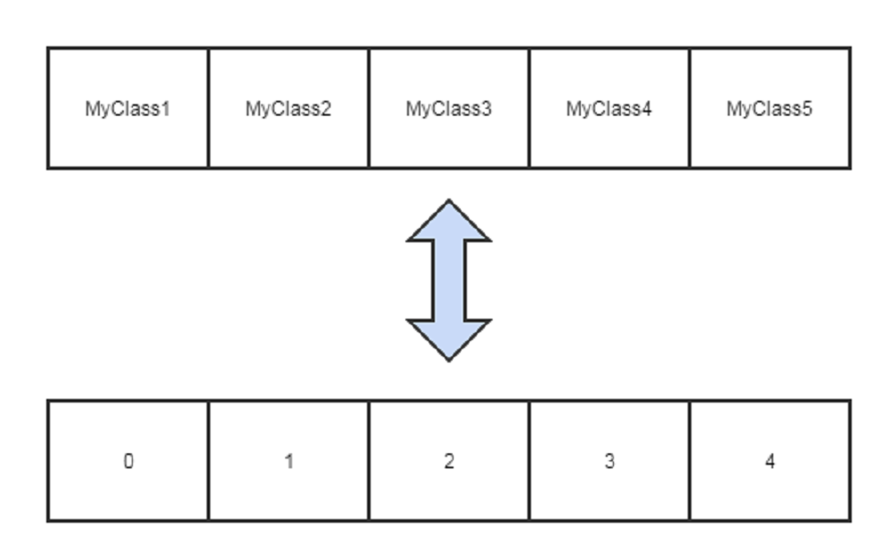
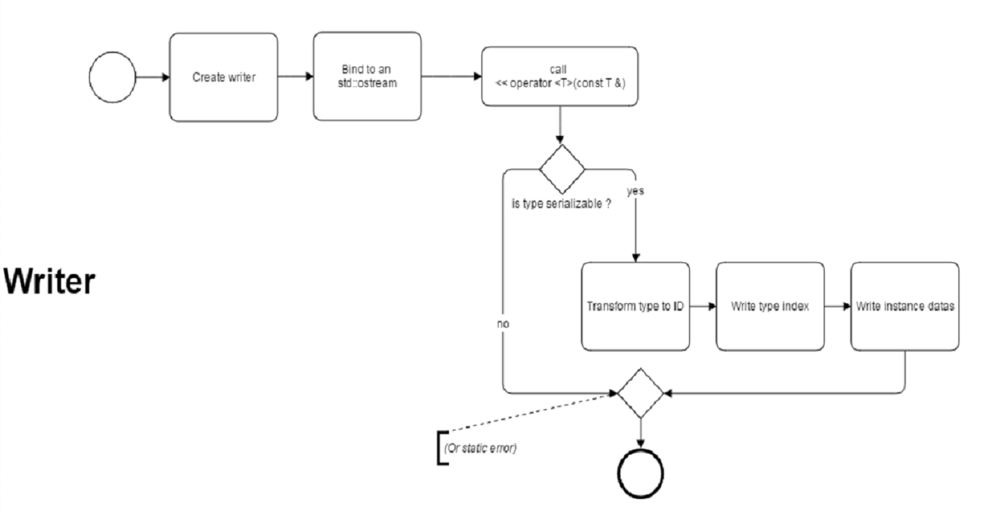
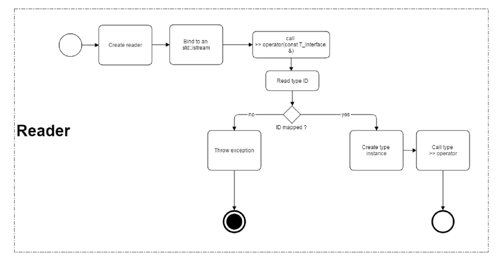

# **C++** Serialization

---

## Guillaume *"Guss"* Dua

---


Problem
-------

Two-way mapping between **types** and `constexpr` **indexes**  
with both **static** and **dynamic** accessors

---

My implementation
-----------------

**Write** "type" information in a file  
and get it back while **reading**

See `GCL::Serialization`  
(github.com/GuillaumeDua/GCL_CPP)[https://github.com/GuillaumeDua/GCL_CPP]


*static* mapping Type <--> Index
================================
 



*static* mapping Type <--> Index
================================

```cpp
template <typename ... Types>
struct TypePack
{
  using types_t = std::tuple<Types...>;

  template <typename T>                                        // Template function
  static constexpr inline size_t indexOf(void);                // Type -> ID
	
  template <size_t N>                                          // Template type
  using TypeAt = typename std::tuple_element<N, types_t>::type; // ID -> Type
};
```

```cpp
using MyType = TypePack<...>.TypeAt<42>;               // correct
const size_t index = TypePack<...>.indexOf<MyType>();  // correct

size_t myTypeIndex = foo();                            // dynamic value
using MyType = TypePack<...>.TypeAt<myTypeIndex>;      // error !
```


*dynamic* mapping Type <--> Index
=================================

1. `std::map<Key, Value>` from template parameters (`Key` and `Value`)
2. Initializer-list for template viariadics expansion
3. Polymorphism


Bring all pieces together
=========================

```cpp
template <class Interface>
struct InterfaceIs
{
  template <typename ...Types>
  struct OfTypes
  {
    template <typename IO_POlicy = IO::Policy::Binary>
    struct Writer;
    
    template <typename IO_POlicy = IO::Policy::Binary>
    struct Reader;
  }
}	
```


Writer
======




Writer
======

```cpp
template <typename IO_POlicy = IO::Policy::Binary>
struct Writer
{
  template <typename T>
  static void write (std::ostream & os, const T & var)
  {
    IO_POlicy::write(os, TypePack<...>::template indexOf<T>());
    os << var;
  }

  template <typename T>
  Writer & operator<< (const T & element)
  {
    write(_oStream, element);
    return *this;
  }
};
```


Reader
======




Reader
======

```cpp
template <typename Policy = Policy::Binary>
struct Reader
{
  // Type -> ID, ID -> Type mapping
  using T_TypeManager = typename TypeTrait::InterfaceIs<_InterfaceType>::template OfTypes<Types...>;

  static _InterfaceType *  read (std::istream & is)
  {
    size_t typeIndex;

    IO_POlicy::read(is, typeIndex);
    if (is.eof()) return 0x0;

    auto & constructor = T_TypeManager::index.at(typeIndex).defaultConstructeurCallerOp;
    _InterfaceType * elem = constructor();
    is >> *elem;
    return elem;
  }
	
  Reader &  operator>> (_InterfaceType *& element);
  Reader &  operator>> (std::queue<_InterfaceType*> & elemQueue);
};
```


Usage
=====

Interface
------------
```cpp
struct TestInterface
{
  virtual void DoStuff() const = 0;
};
```
Classes to serialize
--------------------
```cpp
#define GenTestClass(name, type)                                \
struct name : TestInterface                                     \
{                                                               \						
  name() = default;                                             \
  name(type value) : _value(value){}                            \
                                                                \
  type _value;                                                  \
                                                                \
  void	DoStuff(void) const override                            \
  { std::cout << ""#name##"" " -> value=[" << _value << ']' << std::endl; }   \
                                                                \
  std::ostream & operator<<(std::ostream & os) const  override  \
  { GCL::IO::Policy::Binary::write(os, _value); return os; }    \
                                                                \
  std::istream & operator>>(std::istream & is) override         \
  { GCL::IO::Policy::Binary::read (is, _value); return is; }    \
};
```

```cpp
GenTestClass(Toto, int);
GenTestClass(Titi, std::string);
GenTestClass(Tata, int);
GenTestClass(Tutu, std::string);
```


Usage
=====
Writer
---------
```cpp
using Writer = Serialization::InterfaceIs<TestInterface>::OfTypes<Toto, Titi, Tata, Tutu>::Writer<>;

std::stringstream ss;
Writer writer(ss);
writer
	<< Toto{ 42 }
	<< Titi{ "Hello, world" }
	<< Tata{ 130390 }
	<< Tutu{ "Morning' coffee" }
;
std::cout << "Serialized : [" << ss.str() << ']' << std::endl;
```
Console output
```
Serialized : [    *   ☺   ♀   Hello, world☻   V²☺ ♥   ☼   Morning' coffee]
```


Reader
------
```cpp
using Reader = Serialization::InterfaceIs<TestInterface>::OfTypes<Toto, Titi, Tata, Tutu>::Reader<>;
try
{
  Reader  reader(ss);

  std::queue<TestInterface*> elements;
  reader
    >> elements
  ;

  while (not elements.empty())
  {
    elements.front()->DoStuff();  // TestInterface::DoStuff
    delete elements.front();
    elements.pop();
  }
}
catch (const std::exception & ex)
{
  std::cerr << ex.what() << std::endl;
}
```
Console output
```
Toto -> value=[42]
Titi -> value=[Hello, world]
Tata -> value=[130390]
Tutu -> value=[Morning' coffee]
```


Bonus: Disable serialisation on demand
======================================

* Inspired from **C#** Attribute `[NonSerialized()]`
* C++ implementation based on SFINAE
* [Walter Brown talk's about `std::void_t`](https://www.youtube.com/watch?v=a0FliKwcwXE)

	``` std::void_t<typename T:: > ``` 

```cpp
#define GCL_Introspection__GenHasNested(nested)							\
template< class, class = std::void_t<> >							\
struct has_##nested##_nested : std::false_type { };						\
template< class T >										\
struct has_##nested##_nested<T, std::void_t<typename T::##nested>> : std::true_type { };	\
```


In `GCL::Serialization` ?
-------------------------

```cpp
GCL_Introspection__GenHasNested(NotSerializable)

template <typename T>
struct WriterImpl
{
  static constexpr bool isSerializable = !GCL::Introspection::has_NotSerializable_nested<T>::value;

  template <bool _isSerializable = isSerializable>
  static constexpr void	write_impl(std::ostream & os, const T & var);
  template <>
  static constexpr void	write_impl<true>(std::ostream & os, const T & var)
  {
    IO_POlicy::write(os, _TypesPack::template indexOf<T>());
    os << var;
  }
  
  template <>
  static constexpr void write_impl<false> (std::ostream & os, const T & var)
  {
    // Do nothing or ...
    // static_assert(false, "This type has \"NotSerializable\" static-qualifier");
  }
};
```


Result
------

```cpp
struct NotSerializableType
{
  enum NotSerializable{};
};
```

```cpp
Writer writer(ss);
writer
  << Toto{ 42 }
  << Titi{ "Hello, world" }
  << Tata{ 130390 }
  << Tutu{ "Morning' coffee" }
  << NotSerializableType{}     // Error !
;
```

Compilation error

```cpp
error C2338: This type has "NotSerializable" static-qualifier
```


Evolutions
==========
* Codec
* Encryption
* Backward version compatibility


Annex
=====


What about **C#** ?
-------------------

Few words about  [NonSerialized()] attribute

```Csharp
namespace Sample
{
    public class DataToSerialize
    {
        // ...
        [NonSerialized()] 		// <------- !
        private BigStuff _bigStuff;
    }
}
```
